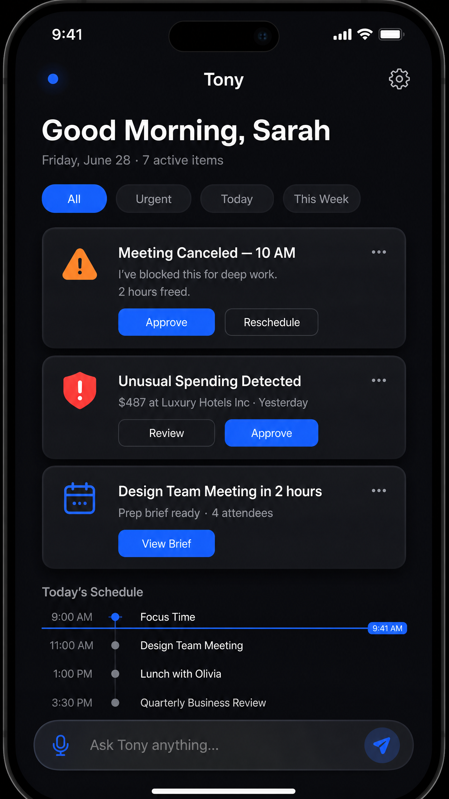
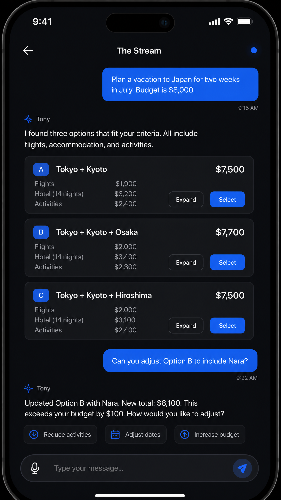
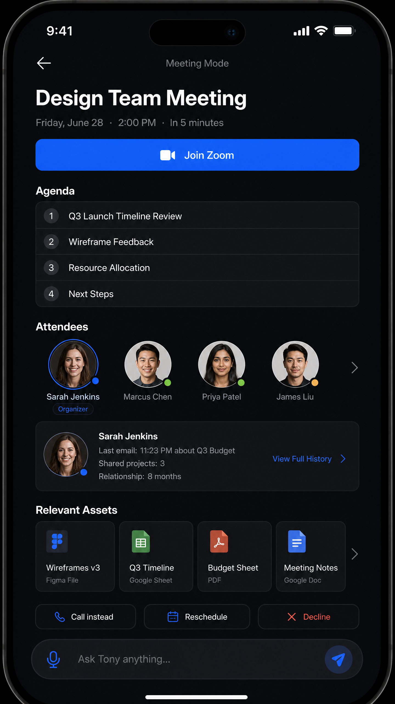
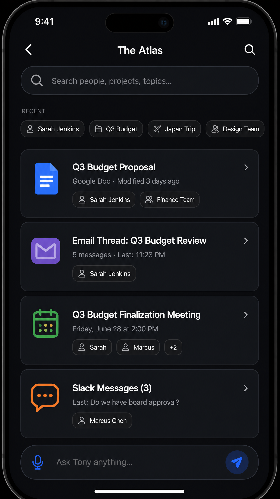
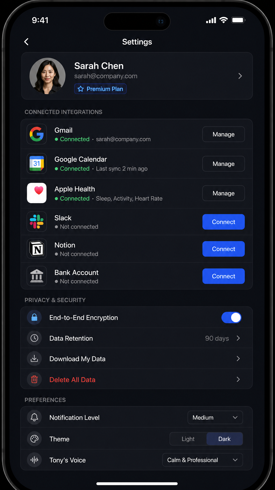
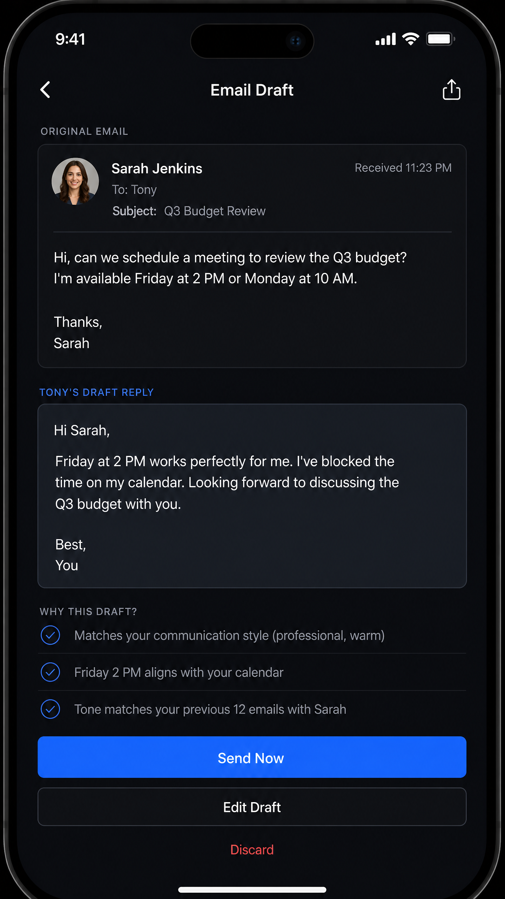
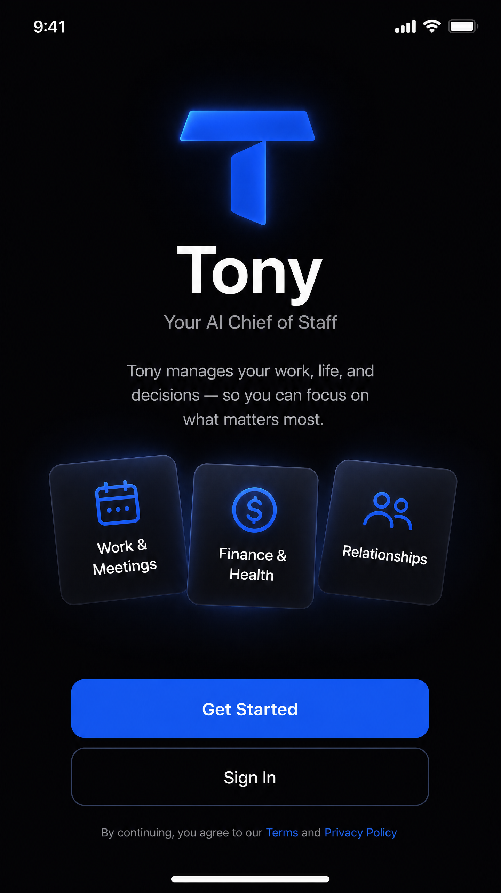

# High-Fidelity Mockups for Tony

This document catalogs all high-fidelity mockups produced for Tony, the AI Chief of Staff. Each mockup represents a polished, pixel-perfect visual design that implements the Design System (see `03_DESIGN_SYSTEM.md`) and brings the wireframes (see `04_WIREFRAMES.md`) to life.

## Design Specifications

All mockups were produced at **1440 × 2560px** (equivalent to a 3x iPhone 15 Pro resolution), ensuring crisp rendering on all modern mobile displays. The dark mode variant is the primary design, with light mode to be produced in the next iteration.

## Mockup Inventory

| # | Screen Name | File | Description |
| :--- | :--- | :--- | :--- |
| 01 | The Now — Morning Briefing | `mockups/01_the_now_morning.png` | Default ambient dashboard showing the Daily Brief |
| 02 | The Stream — Conversational Interface | `mockups/02_the_stream.png` | Conversational interaction with structured option cards |
| 03 | Meeting Prep — Meeting Mode | `mockups/03_meeting_prep.png` | Context-adaptive view before a scheduled meeting |
| 04 | The Atlas — Knowledge Graph Explorer | `mockups/04_the_atlas.png` | Search-driven exploration of the Knowledge Graph |
| 05 | Settings — Integrations and Privacy | `mockups/05_settings.png` | Integration management and privacy controls |
| 06 | Action Card Detail — Email Draft | `mockups/06_action_card_detail.png` | Full view of a proactive email draft with reasoning |
| 07 | Onboarding — Welcome Screen | `mockups/07_onboarding.png` | First-launch screen with value proposition |

## Screen Descriptions

### 01 — The Now (Morning Briefing)

The primary ambient dashboard. Displays a personalized greeting, filter chips for prioritization, three Action Cards for urgent items, and a compact daily schedule. The persistent input bar at the bottom enables instant conversational access. The blue pulsing status dot in the top-left indicates Tony is actively processing background information.

### 02 — The Stream (Conversational Interface)

The conversational interaction layer. User messages appear as right-aligned blue bubbles; Tony's responses appear left-aligned with a subtle AI icon. Structured option cards present complex information (e.g., travel itineraries) in a scannable, interactive format. Suggestion chips at the bottom of Tony's responses enable quick follow-up actions without typing.

### 03 — Meeting Prep (Meeting Mode)

A context-adaptive view that automatically activates when a meeting is imminent. Features a prominent "Join Zoom" CTA, a numbered agenda, a scrollable attendee row with relationship context, relevant asset cards, and quick action buttons. The Sarah Jenkins context card demonstrates the progressive disclosure pattern, showing relationship history inline.

### 04 — The Atlas (Knowledge Graph Explorer)

The exploration layer for the Knowledge Graph. A prominent search bar sits at the top, with recent search chips for quick access. Search results are displayed as unified cards across all data types (documents, emails, meetings, messages), each annotated with context pills linking to related entities. This view eliminates the need to search across multiple apps.

### 05 — Settings (Integrations and Privacy)

A clean, organized settings interface. The user profile is displayed prominently at the top. Integration rows show real-time connection status with green/gray status dots. The Privacy & Security section features a prominent End-to-End Encryption toggle and a clearly visible "Delete All Data" option in red, reinforcing Tony's commitment to user data control.

### 06 — Action Card Detail (Email Draft)

The expanded view of a proactive email draft. Shows the original email for context, Tony's drafted reply, and a "Why This Draft?" section that explains the AI's reasoning with three checkmark items. The three-tier action hierarchy (Send Now, Edit Draft, Discard) guides the user toward the optimal action while preserving full control.

### 07 — Onboarding (Welcome Screen)

The first-launch experience. The geometric 'T' logo with a soft blue glow establishes the brand identity immediately. The three floating feature cards (Work & Meetings, Finance & Health, Relationships) communicate Tony's scope at a glance. The two-button CTA (Get Started / Sign In) provides clear paths for new and returning users.

---
**Status:** Approved | **Version:** 1.0 | **Author:** Manus AI
